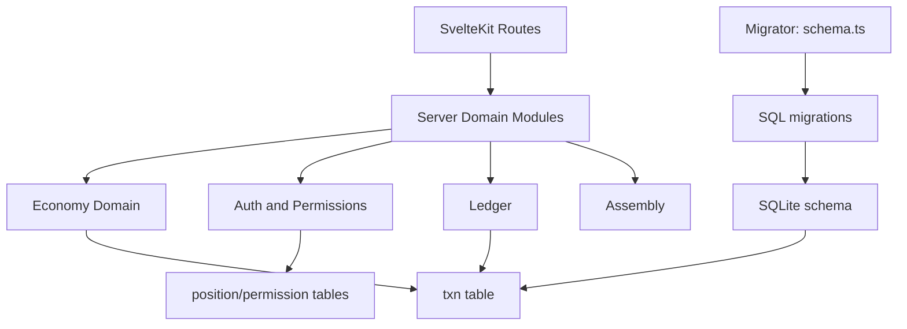

# Resolute Society

Resolute Society is self-hosted software for communities that take their independence seriously. It is built around two convictions: that a free people must be able to meet their own needs, and that the right of self-government is worth protecting in practice, not just in principle.

## Purpose

**Meeting member needs.** A society exists to serve its members. Resolute Society provides tools for communities to plan and coordinate around the essentials — food, shelter, healthcare, and security — so that dependence on distant institutions is a choice rather than a necessity. Nutrition planning, local economic activity, a community market, and a shared treasury are all oriented toward this end.

**Civic participation.** Strong communities require genuine participation, not just passive membership. Resolute Society gives groups the structures to govern themselves at the local level — assemblies, officers, charters, and the means to form compacts with neighboring groups — so that civic life is something members actively shape.

## What It Does

- **Economy and ledger** — dual-currency treasury, peer transfers, demurrage, and disbursements managed through a double-entry ledger
- **Governance** — assembly records, officer positions, permissions, and a society charter
- **Member directory** — people, associations, and dependants tracked within the society
- **Nutrition planning** — science-grounded food and requirement planning for the community
- **Local map and road graph** — offline tile caching and road-distance routing for when fuel and infrastructure cannot be taken for granted
- **Market** — a local marketplace for goods and services among members
- **Courses and education** — structured learning for community skill-building
- **Federation** — secure messaging and economic coordination between allied societies and compacts
- **Calendar and events** — shared scheduling for society activities

## Deploying to a DigitalOcean Droplet

The bootstrap script installs Docker, configures the firewall, downloads the compose file and Caddyfile, and creates helper scripts for managing the application.

**1. Create a droplet** running Ubuntu 22.04 or later. A 1 GB / 1 CPU droplet is sufficient to start.

**2. Point your domain's A record** at the droplet's IP address before running the script, so Caddy can provision a TLS certificate on first start.

**3. SSH into the droplet and run the bootstrap script:**

```sh
curl -fsSL https://raw.githubusercontent.com/cirodam/resolute-society/master/scripts/bootstrap-droplet.sh -o bootstrap.sh
sudo bash bootstrap.sh bfsathensga.org
```

Replace `society.example.com` with your actual domain. You can also omit it and set `DOMAIN` manually afterward in `/opt/resolute-society/.env`.

**4. Start the application:**

```sh
cd /opt/resolute-society
./start.sh
```

After about two minutes for SSL provisioning, visit `https://society.example.com/setup` to create the first account.

**Ongoing management** (run from `/opt/resolute-society`):

```sh
./stop.sh          # stop services
./logs.sh          # tail all logs
./logs.sh app      # tail app logs only
./logs.sh caddy    # tail Caddy logs only
./update.sh        # pull latest image and restart
./backup.sh        # back up the database volume to ./backups/
```

## Development

Install dependencies:

```sh
npm install
```

Run in development:

```sh
npm run dev
```

Build and preview:

```sh
npm run build
npm run preview
```

## Database Migrations

Schema management is migration-based.

- Migration SQL files live in [src/lib/server/migrations](src/lib/server/migrations)
- Migration runner lives in [src/lib/server/schema.ts](src/lib/server/schema.ts)
- Migrations execute at startup via [src/hooks.server.ts](src/hooks.server.ts)

The migration runner:
- ensures a `schema_migration` table exists,
- applies pending `*.sql` files in lexical order,
- verifies required cross-entity handle guard triggers are present.

## Handle Namespace And Addressing

See [docs/handle-namespace-and-addressing.md](docs/handle-namespace-and-addressing.md) for:
- society and compact shared handle namespace policy,
- supported principal address formats,
- trigger-level enforcement details.

## Nutrition Planning Science Standard

See [docs/nutrition-science-standard.md](docs/nutrition-science-standard.md) for:
- authoritative nutrition data and requirement sources,
- canonical units and nutrient definitions,
- requirement aggregation and gap-classification policy,
- validation and reproducibility requirements.

## Nutrition And Seed Library Domain Split

See [docs/nutrition-and-seed-library-architecture.md](docs/nutrition-and-seed-library-architecture.md) for:
- separation between nutrition planning and agriculture/seed-library systems,
- bridge-layer mapping from crop outputs to edible food inputs,
- recommended v1 boundaries and versioning strategy.

See [docs/nutrition-v1-implementation-plan.md](docs/nutrition-v1-implementation-plan.md) for:
- detailed nutrition data model and calculation pipeline,
- phased rollout and acceptance criteria,
- v1 risk handling for demographic/cohort input.

## Architecture Map



Primary server modules:
- [src/lib/server/README.md](src/lib/server/README.md)
- [src/lib/server/economy/README.md](src/lib/server/economy/README.md)
- [src/lib/server/migrations/README.md](src/lib/server/migrations/README.md)

## Checklist: Add A Principal Type

1. Add new principal type support to ledger entity typing in `src/lib/server/ledger.ts`.
2. Update balance and money-supply aggregation logic for the new entity.
3. Add address resolution behavior if the principal can receive addressed payments.
4. Add permission/policy checks for actions that can move money to or from the principal.
5. Update demurrage/disbursement flows if the principal participates in either.
6. Add tests for balance calculation, addressing resolution, and money-moving behavior.
7. Add migration SQL for new tables/indexes/triggers if needed.

## Checklist: Add A Currency

1. Extend currency typing and validation in ledger/economy modules.
2. Add currency-aware calculations for balances and supply reporting.
3. Decide where the currency is allowed in route actions and policy guards.
4. Ensure transaction creation helpers validate/accept the new currency.
5. Add or adjust migration SQL for any currency-specific constraints.
6. Add tests for transfer, demurrage, and insufficient-funds paths in the new currency.
7. Update documentation for user-facing address and transfer semantics.
