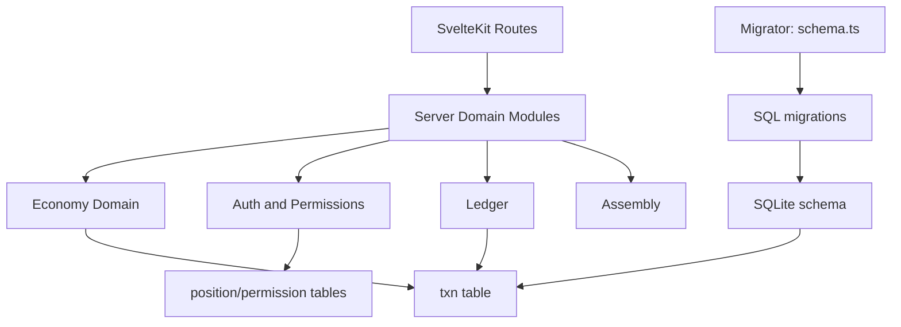

# Resolute Society

Resolute Society is a SvelteKit + TypeScript application backed by SQLite. It models societies,
federation services, compacts, governance, education, and dual-currency economic activity.

## Development

Install dependencies:

```sh
npm install
```

Run in development:

```sh
npm run dev
```

Build and preview:

```sh
npm run build
npm run preview
```

## Database Migrations

Schema management is migration-based.

- Migration SQL files live in [src/lib/server/migrations](src/lib/server/migrations)
- Migration runner lives in [src/lib/server/schema.ts](src/lib/server/schema.ts)
- Migrations execute at startup via [src/hooks.server.ts](src/hooks.server.ts)

The migration runner:
- ensures a `schema_migration` table exists,
- applies pending `*.sql` files in lexical order,
- verifies required cross-entity handle guard triggers are present.

## Handle Namespace And Addressing

See [docs/handle-namespace-and-addressing.md](docs/handle-namespace-and-addressing.md) for:
- society and compact shared handle namespace policy,
- supported principal address formats,
- trigger-level enforcement details.

## Nutrition Planning Science Standard

See [docs/nutrition-science-standard.md](docs/nutrition-science-standard.md) for:
- authoritative nutrition data and requirement sources,
- canonical units and nutrient definitions,
- requirement aggregation and gap-classification policy,
- validation and reproducibility requirements.

## Nutrition And Seed Library Domain Split

See [docs/nutrition-and-seed-library-architecture.md](docs/nutrition-and-seed-library-architecture.md) for:
- separation between nutrition planning and agriculture/seed-library systems,
- bridge-layer mapping from crop outputs to edible food inputs,
- recommended v1 boundaries and versioning strategy.

See [docs/nutrition-v1-implementation-plan.md](docs/nutrition-v1-implementation-plan.md) for:
- detailed nutrition data model and calculation pipeline,
- phased rollout and acceptance criteria,
- v1 risk handling for demographic/cohort input.

## Architecture Map



Primary server modules:
- [src/lib/server/README.md](src/lib/server/README.md)
- [src/lib/server/economy/README.md](src/lib/server/economy/README.md)
- [src/lib/server/migrations/README.md](src/lib/server/migrations/README.md)

## Checklist: Add A Principal Type

1. Add new principal type support to ledger entity typing in `src/lib/server/ledger.ts`.
2. Update balance and money-supply aggregation logic for the new entity.
3. Add address resolution behavior if the principal can receive addressed payments.
4. Add permission/policy checks for actions that can move money to or from the principal.
5. Update demurrage/disbursement flows if the principal participates in either.
6. Add tests for balance calculation, addressing resolution, and money-moving behavior.
7. Add migration SQL for new tables/indexes/triggers if needed.

## Checklist: Add A Currency

1. Extend currency typing and validation in ledger/economy modules.
2. Add currency-aware calculations for balances and supply reporting.
3. Decide where the currency is allowed in route actions and policy guards.
4. Ensure transaction creation helpers validate/accept the new currency.
5. Add or adjust migration SQL for any currency-specific constraints.
6. Add tests for transfer, demurrage, and insufficient-funds paths in the new currency.
7. Update documentation for user-facing address and transfer semantics.
